# GF3 Puppetmaster Joystick Module Assembly Instructions
## General Notes
* Refer to CAD for final location of each part.
* Any hardware can be replaced with an alternative part that fit on assembly.
* Aluminum framing parts can be replaced by equivalent alternatives from other vendors. The current design uses 40mm standard framing parts, but 1.5 inch standard framing parts will also work, as long as all other framing parts are switched to their 1.5 inch equivalents, and the GF3 mounting plate and FFB mounting plate have their hole patterns updated.
* Check the BOM against current CAD before purchasing parts.

## Tools required
* Small Phillips screwdriver
* Soldering iron and solder
* 22 AWG stranded wire or similar
* Heat shrink tube
* Hacksaw or other method of cutting 3/16" aluminum sheet
* Center punch
* Drill and drill bits
* 90 degree countersink bit
* Set of metric Allen keys
* 2X Small adjustable wrenches

## Instructions
### Prepare Gunfighter Gimbal
1. Disassemble the Gunfighter gimbal per [VKB instructions](https://www.youtube.com/watch?v=dc8LZyThYs0) and install a soft center space cam (Space-S) and one #10 spring on each axis. This balances out the weight of the final joystick and prevents it from tilting.
2. Adjust dry clutches to not be too tight, otherwise the force feedback will be reduced. For example, I set the clutch screws to compress the clutch springs halfway. Apply damping grease to the dry clutches at this point if you wish.
3. Reassemble the Gunfighter gimbal.

### Prepare FFB Gimbal
1. Ensure FFB stick works correctly before disassembly.
2. Unplug FFB stick and open its case. Some of the screws have a special cross feature that make them difficult to untorque, unscrew these slowly while pushing down on them.
3. Unscrew and remove the power PCB (the one that the power cable connects to). Take care not to touch any of the solder joints or PCB traces as the capacitors may still carry charge.
4. Unplug the connector on the power PCB that attaches it to the main PCB (the one with the Microsoft logo).
5. Unplug all electrical connectors from the main PCB and remove it, retaining all its fasteners for later use. Note that the USB cable is soldered to the board and will stay connected.
6. Unscrew the handle from the gimbal and remove the handle by passing its electrical connectors through the center tube.
7. Unscrew the gimbal from the case and set aside.
8. The gimbal motors contain magnets which can attract loose hardware into the motor vent holes. Cover these holes with tape, to be removed later after assembly is complete.

### Modify FFB PCB
1. Solder one 1-ohm current sense resistor on top of each of 8X resistors marked in the picture.\
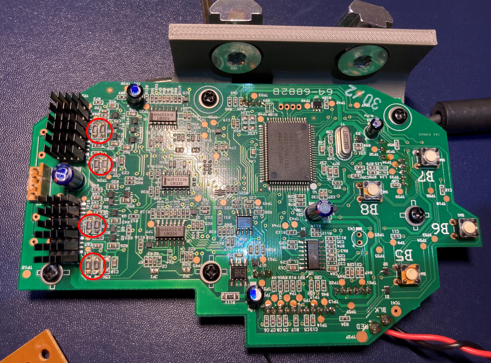
2. Clean the tops of the FETs with isopropanol and attach a self adhesive heat sink to each one.
3. Solder short 22 AWG wires to the purchased power connector header. Connect these wires to the barrel connector that comes with the purchased 24V power supply. Ensure that the red wire (positive) coming from the main PCB is connected to the center pin of the barrel connector.
4. Apply heat shrink tube over these wires.

### Print and Assemble 3D Printed Parts
1. 3D print the parts in the "3D Print Files" folder. STL files are in millimeter units. Recommended print orientation shown below. I used ABS with 50% infill, which felt sturdy under operation. Other printed materials will likely also work, but I'd recommend no less than 50% infill for stiffness.\
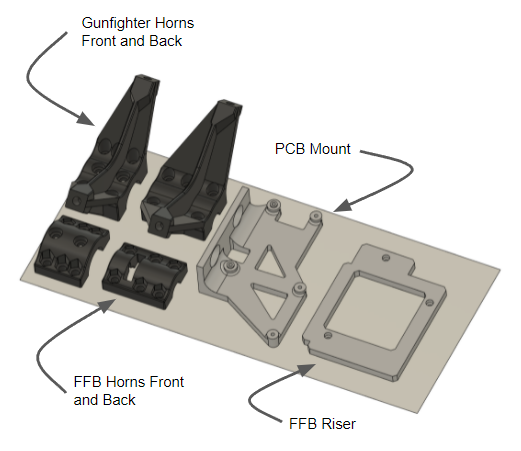
2. Heat up the heat set inserts and press them into the holes at the end of the FFB front horns and Gunfighter front horns.\
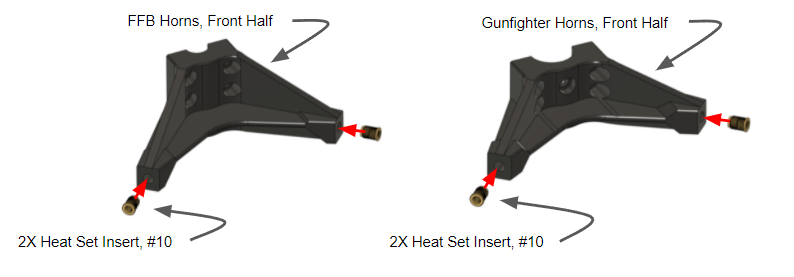
3. Attach Gunfighter Horns to the Gunfighter stick extension using the 6x #10-32 socket head cap screws and the two original screws at the base of the stick extension. Do not overtighten the 6x #10-32 screws to avoid cracking these printed parts.\
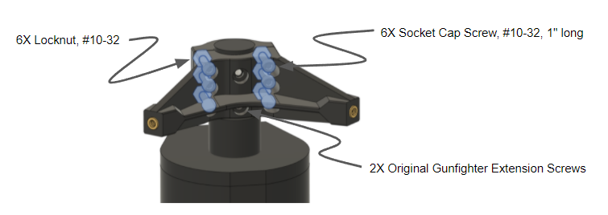
4. Attach FFB Horns to the FFB stick base using the 6x #10-32 socket head cap screws. Do not overtighten the screws to avoid cracking these printed parts.\
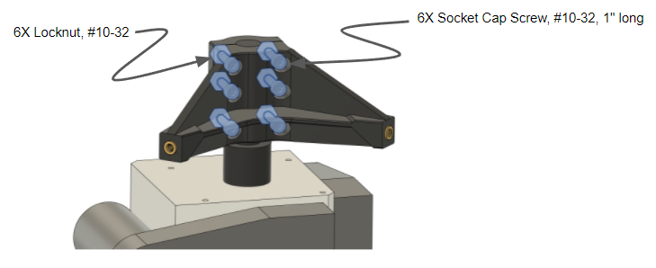
5. Attach FFB PCB to the PCB Mount using the original screws from the PCB\
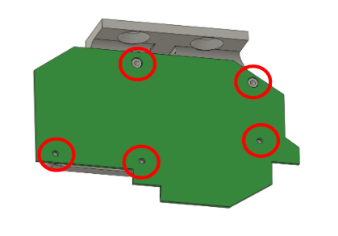

### Assemble Tie Rods
1. Apply lithium grease or other light grease to the rod end sphericals, and rotate the sphericals so that they are uniformly greased.\
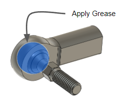
2. Install jamnuts and rod ends on each end of both threaded rods. Adjust rod ends so that there is 136.5mm of separation between rod ends. Do not torque jamnuts yet, leave them loose.\
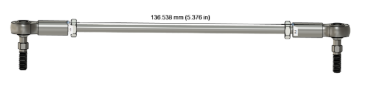

### Mount Gimbals
1. Cut the 3" x 12" aluminum sheet into two 3" x 6" pieces.
2. Print "GF3 Mounting Plate Drawing.pdf" at actual size. Tape one of the aluminum sheets to this printout and center punch the hole locations.
3. Drill the aluminum sheet per the drawing. Countersink holes using 90 degree tip countersink bit.\
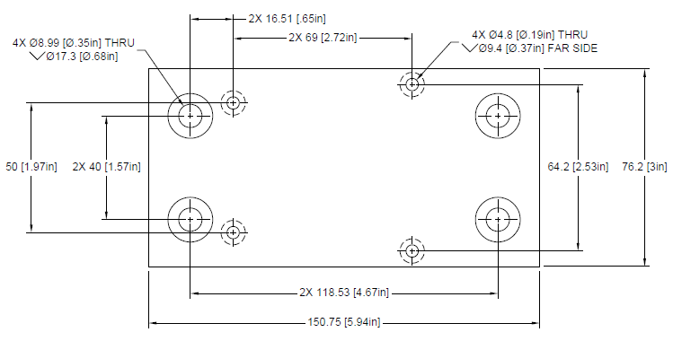
4. Print "FFB Mounting Plate 2 Drawing.pdf" at actual size. Tape the other aluminum sheet to this printout and center punch the hole locations.
5. Drill the aluminum sheet per the drawing. Countersink holes using 90 degree tip countersink bit.\
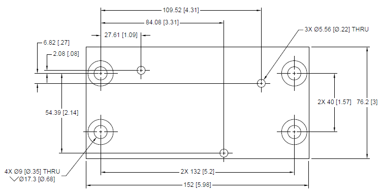
6. Attach Gunfighter gimbal to the GF3 Mounting Plate using its 4x original screws.\
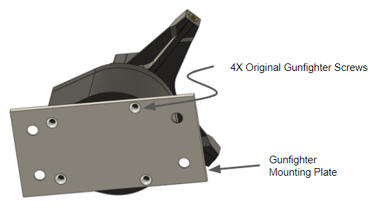
7. Attach the FFB Riser and FFB Mounting Plate to the FFB gimbal using the #4 screws and washers.\
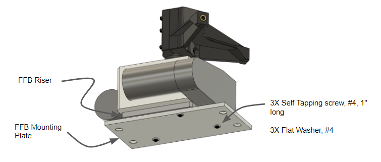

### Drill FFB Beam
1. Print "Drilled Bottom Beam Drawing.pdf" at actual size. Tape the bottom beam PN HFSL8-4080-215 to this printout and center punch the hole locations.
2. Pilot drill each location with a 3mm or equivalent bit, then countersink each hole for a final OD of roughly 10mm. The partial hole is pretty weird, I had to pilot drill at the edge of where the final countersink should end up, and then run the countersink bit into this pilot hole at an angle.\
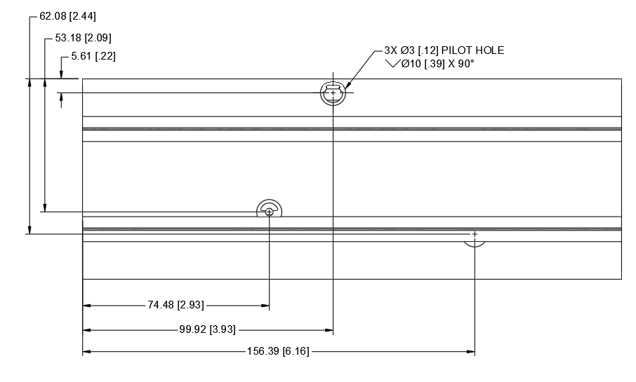\
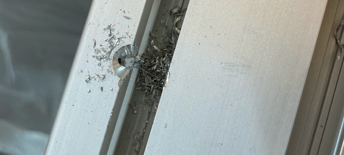

### Assemble Puppetmaster Joystick Module
1. Temporarily unscrew and detach the rear motor from the FFB gimbal. The gear attached to the shaft prevents the motor from coming completely off, but having it hang loose provides enough room to torque the screws in the next step.\
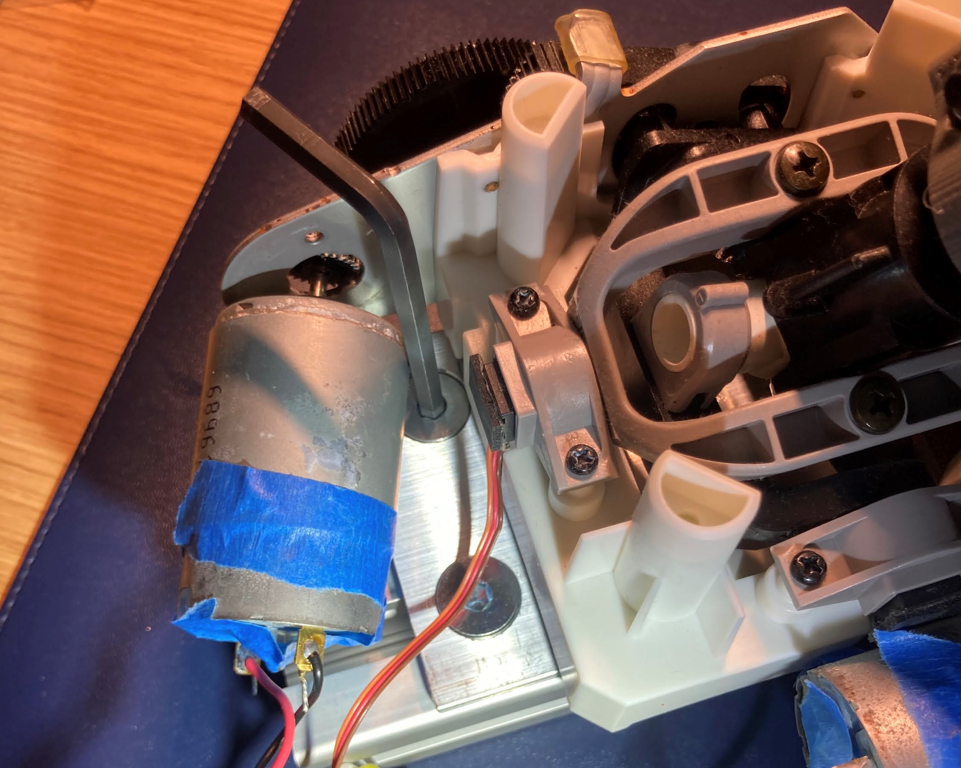
2. Install flat head screws and slot nuts to the 4x mounting holes on the FFB Mounting Plate. Slide this mounting plate onto its aluminum beam leaving 21mm between the rear of the mounting plate and the beam, then torque the flat head screws. Reattach the rear motor to the FFB gimbal.\
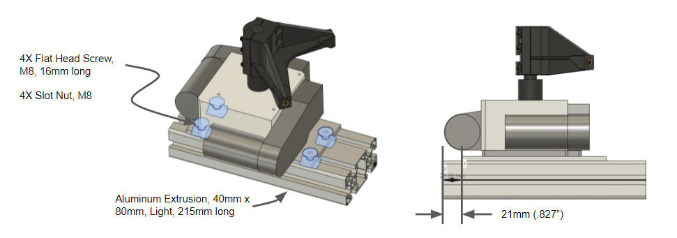
3. Install flat head screws and slot nuts to the 4x mounting holes on the Gunfighter Mounting Plate. Slide this mounting plate onto its aluminum beam, leaving 12.7mm between the rear of the mounting plate and the beam, then torque the flat head screws.\
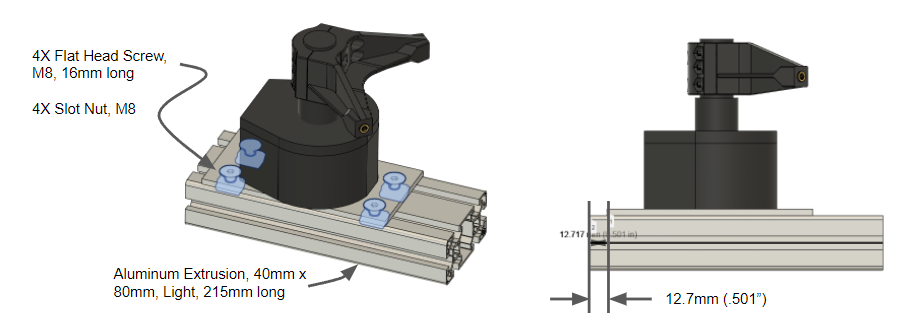
4. Install flat head screws and slot nuts to the 2x mounting holes on the PCB Mount. Slide mount onto its aluminum beam, leaving 7.9mm between the rear of the mount and the beam, then torque the flat head screws.\
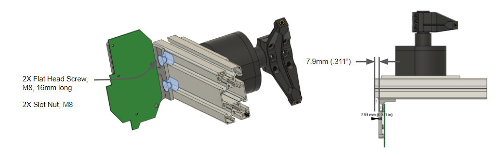
5. Attach the front vertical aluminum beam to the Gunfighter and FFB aluminum beams using the right angle brackets. Leave 152mm between top beam and bottom beam. Ensure all beams are aligned flush with one another, then torque fasteners.\
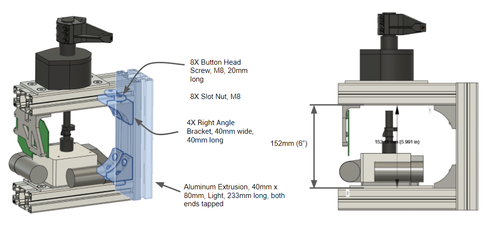
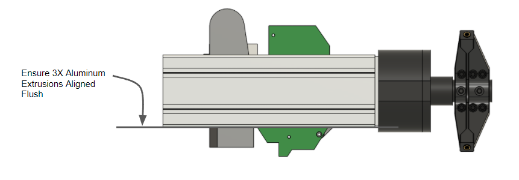
6. Attach the FFB motor and potentiometer wires to the FFB PCB
7. Check if the Gunfighter gimbal is centered vertically over the FFB gimbal. If not, loosen the Gunfighter flat head screws, adjust the location of the Gunfighter gimbal, then retighten the screws.\
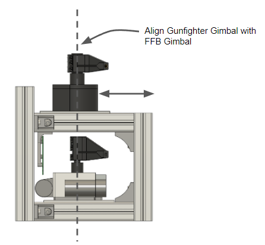
8. Install the tie rods into the Gunfighter horns and FFB horns part way, do not fully torque. Move the Gunfighter gimbal through its entire range of motion and note in when the FFB gimbal hits its hard stops. Remove tie rods and adjust their lengths so that the FFB gimbal hit its hard stops exactly when the Gunfighter gimbal hits its hard stops.\
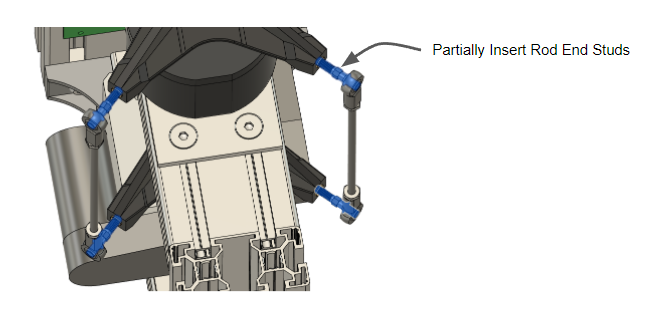
9. Screw the rod ends into the Gunfighter horns and FFB horns fully, torque until snug. Do not overtorque to avoid damaging the printed parts. Tighten jamnuts.\
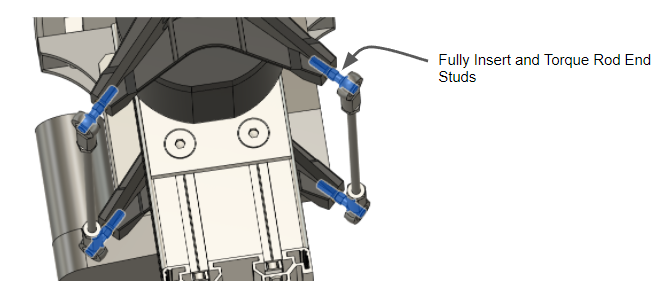
10. Remove protective tape from FFB motors. Plug USB connector into computer and plug 24V power supply into barrel connector. Ensure FFB gimbal is working correctly and providing force feedback.