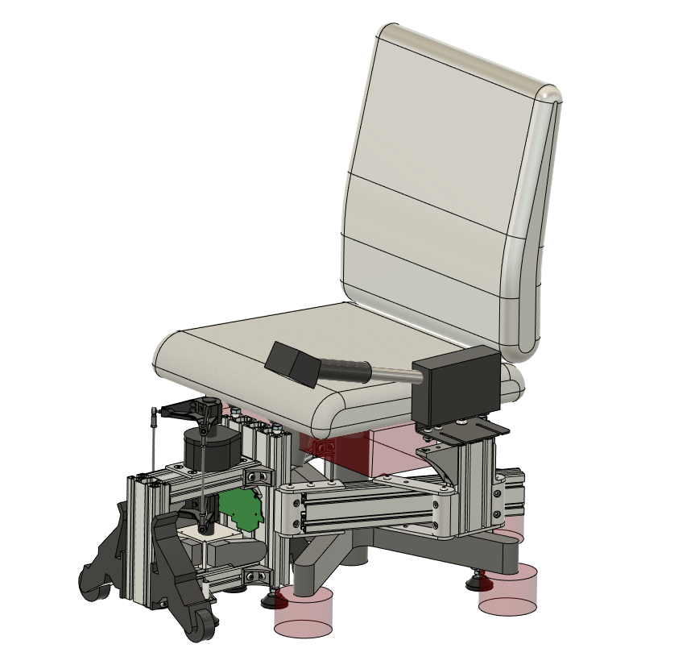
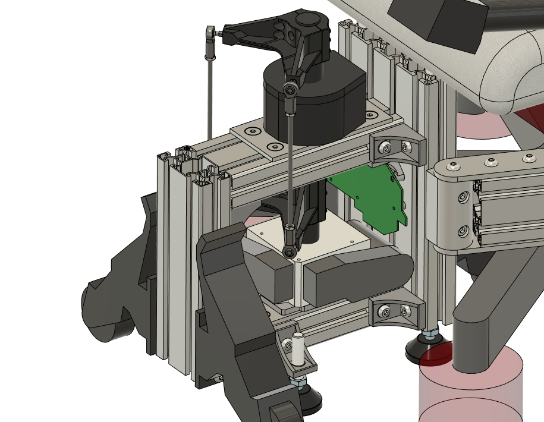
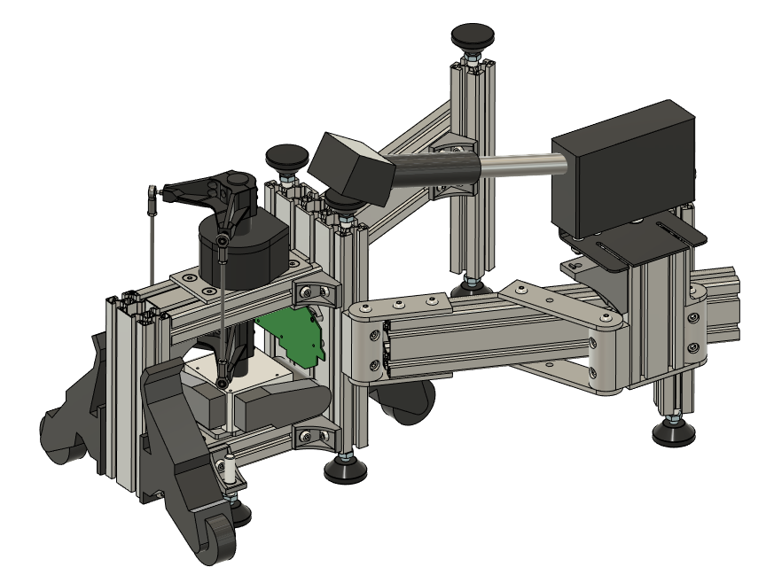
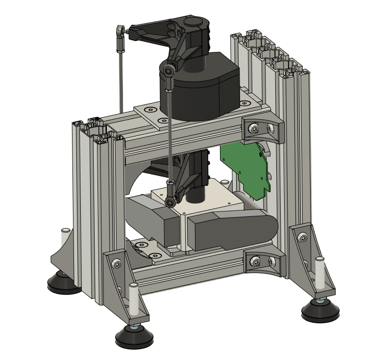
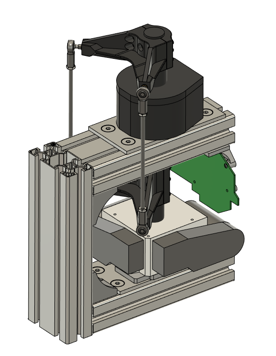
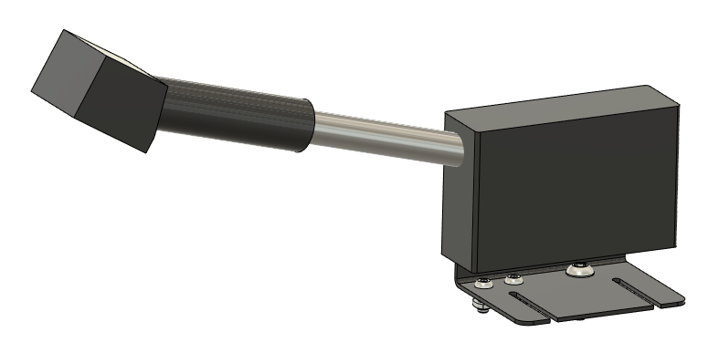

# Proteus Simpit
Proteus is a flight simpit designed to fit under a standard rolling office chair, and can mount different joystick, throttle, collective, and rudder modules. Legs on the simpit frame hold the chair suspended in the air, guaranteeing that the seat will not roll or rotate. The simpit folds up when not in use, and features retractable wheels to allow the setup to easily roll out of the way. The frame is constructed mostly from off the shelf aluminum framing components.

The Puppetmaster joystick module is the main part of the Proteus simpit. It combines the force feedback capabilities of a Microsoft Sidewinder Force Feedback 2 with the precision and increased button count of a modern flight stick. A bare Microsoft force feedback gimbal is mounted on the bottom of the Puppetmaster frame and is mechanically coupled to a flight stick on top of the frame. Because it uses the original Microsoft Force Feedback 2 PCB, all original DirectInput force feedback effects are supported. Currently, the VKB Gunfighter MkIII with stick extension is used as the flight stick, but you could modify the design to support any other flight stick with a stick extension. The Puppetmaster frame is constructed from off the shelf aluminum framing components and 3D printed parts.

## Current Configurations
* Proteus Simpit With All Modules
  * Mounts GF3 Puppetmaster Joystick Module in center
  * Mounts K51 Collective Module on left swingarm
  * Total cost: $1483

  

* GF3 Puppetmaster Standalone Joystick
  * Mounts GF3 Puppetmaster Joystick Module on free standing feet
  * Total cost: $892

  

## Current Modules
* GF3 Puppetmaster Joystick Module
  * Mounts a VKB Gunfighter MkIII with stick extension
  * Uses a Microsoft Sidewinder Force Feedback 2 gimbal
  * Cost of parts other than VKB Gunfighter MkIII: $336
  * Total cost: $795

  

* K51 Collective Module
  * Mounts a K-51 collective
  * Cost of parts other than K-51: $6
  * Total cost: $303

  

* Notionally plan to add more modules in the future

## Files and Instructions
The following files are included in each module's folder:
* CAD files, Fusion 360 and STEP format
* Drawings (if relevant)
* 3D Print Files, STL format (if relevant)
* Build instructions
* BOM

## Technical Notes
* Out of the box, the FFB gimbal does not have enough torque to adequately drive a flightstick with stick extension. Thus, the assembly instructions for the Puppetmaster joystick module includes steps to solder resistors to the FFB PCB to double the motor torque, using the method described by [Roland van Roy](http://www.simprojects.nl/ms_siderwinder_ff2_hack.htm) and others.
* With the above resistor mod, the Puppetmaster joystick produces 1.7 N-m of torque max (after subtracting torque due to friction). This feels roughly equivalent to a medium-light spring loaded cam. When held at max torque, there does not seem to be a torque falloff with time. By comparison, the Brunner CLS-E is advertised at 4.2 N-m of torque. However this [review](https://www.reddit.com/r/hoggit/comments/hu4uif/comment/fylmze2/?utm_source=share&utm_medium=web2x&context=3) states that it actually maxes out at 3.6 N-m and gradually falls off to 1.4 N-m over ~40s.
* The Puppetmaster joystick has a bit of a vague-feeling center, meaning that trimming to a certain position is less precise than desirable. Measuring from the top of the grip, the stick can be moved in roughly a 15mm diameter circle with little to no centering feeling. When the gear on the motor is clamped and prevented from turning, the stick can be moved in a roughly 7mm diameter circle freely, indicating that backlash in the mechanisms account for about half of the size of the vague center. The rest comes from the motor itself, potentially due to cogging.
* There seem to be three main sources of backlash in the Puppetmaster joystick FFB mechanism - slop in the rod ends, gap between teeth of the FFB gears, gap between the ID of the FFB gears and their axles, and cogging in the FFB motors. Using rod ends with tight nylon or teflon races essentially eliminates the first source.
* The Gunfighter MkIII gimbal has about +/-21 degrees of travel on each axis, and the FFB gimbal has about the same amount. The rod ends in the Puppetmaster mechanism have just enough angular range to accommodate this motion. When using a different top joystick with more travel, do not force it to the ends of its travel to avoid damaging the FFB gimbal or the rod ends.
* With the additional weight of the Puppetmaster linkages attached to it, the Gunfighter stick will tilt under its own weight. However, using VKB soft space cams along with #10 springs will balance out the effect of gravity and prevent this tilting.
* For adjustable damping, friction, and force trim effects, you can use [SimFFB](https://github.com/joeyjojojunior/simFFB). Note that SimFFB makes an exclusive connection to the FFB stick. You can either have SimFFB or the flight sim control force feedback effects, but not both.

## Support
* For general discussion and help, feel free to leave a post in the [Discussions board](https://github.com/aurism/proteus-simpit/discussions).
* If you find an issue with the design or instructions, please open an [Issue report](https://github.com/aurism/proteus-simpit/issues).

## Videos
* [Force Feedback Test](https://youtu.be/MUK2omoil2U)
